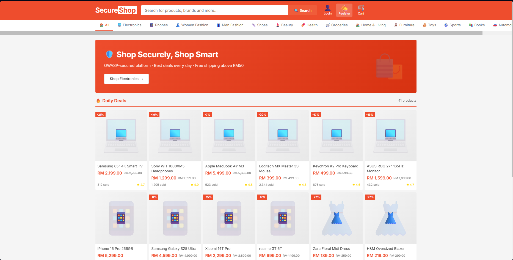
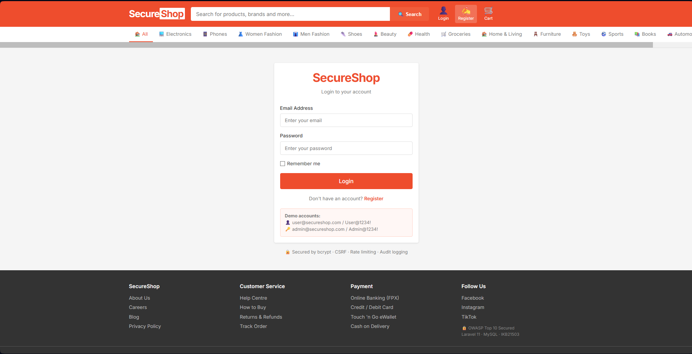
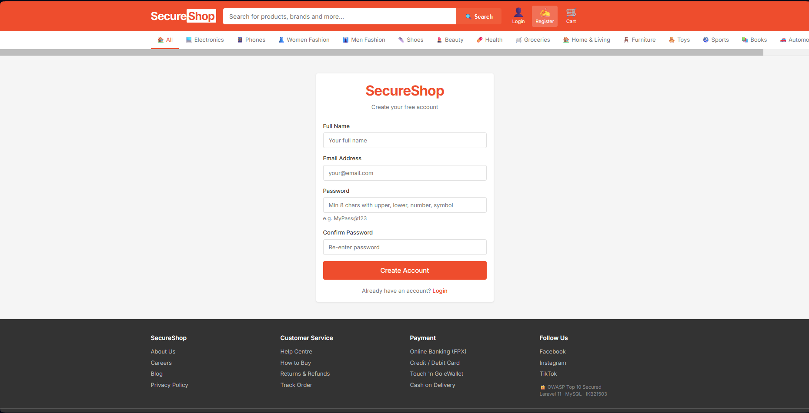
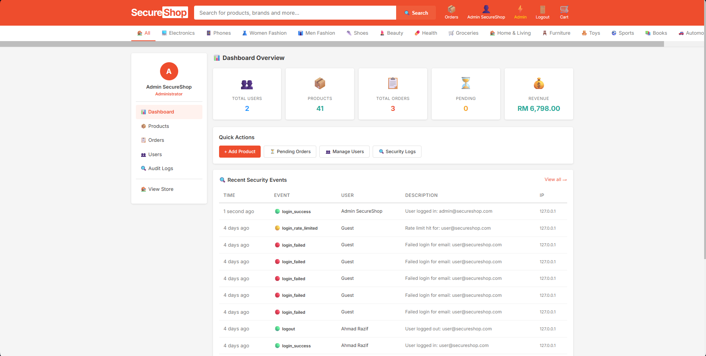

# SecureShop

**IKB21503 — Secure Software Development**

OWASP Top 10 compliant e-commerce web application built with Laravel 11 and MySQL.

| Info | Detail |
|---|---|
| **Course** | IKB21503 Secure Software Development |
| **Group** | L03-B03 |
| **Version** | v1.0.0 |

### Team Members

| Student ID | Name | Role |
|---|---|---|
| 52215125319 | Muhammad Afiq Farhan bin Mohd Nasaruddin | Security Mitigation Development (100%)<br>Back-End Development (20%)<br>Penetration Testing (20%)<br>Documentation (20%) |
| 52215125329 | Muhamad Akmal Safwan bin Mohd Zaki | Front-End Development (100%)<br>Back-End Development (80%)<br>Git Management (50%) |
| 52215125249 | Muhammad Syamil Najhan bin Norman | Penetration Testing (80%) |
| 52215125131 | Nur Husnina Azra binti Jalal | Git Repository Management (50%)<br>Documentation (80%)<br>Project Time Management (100%) |

---

## Project Description

SecureShop is a full-featured e-commerce platform that demonstrates the application of secure coding practices in a real-world Laravel web application. Users can browse products, manage a shopping cart, and place orders. Administrators can manage products, users, and orders through a protected dashboard. The application is built in compliance with the OWASP Top 10 and evaluated against the OWASP Application Security Verification Standard (ASVS).

**Key features:**
- Product catalogue with search and category filtering
- Persistent shopping cart (database-backed, survives logout)
- Order placement and order history
- Admin dashboard with product, user, and order management
- Full audit log viewer for security monitoring

---

## Dependencies

### Server Requirements
| Dependency | Version | Purpose |
|---|---|---|
| PHP | ^8.2 | Server-side runtime |
| Composer | Latest | PHP dependency manager |
| XAMPP (Apache + MySQL) | Latest | Local web server and database |

### PHP Packages (via Composer)
| Package | Version | Purpose |
|---|---|---|
| laravel/framework | ^11.0 | Core MVC framework |
| laravel/breeze | ^2.0 | Authentication scaffolding |
| laravel/tinker | ^2.9 | Interactive REPL for artisan |
| spatie/laravel-permission | ^6.0 | Role & permission management |

### Dev Dependencies
| Package | Purpose |
|---|---|
| phpunit/phpunit ^11.0 | Unit and feature testing |
| phpstan/phpstan ^1.10 | Static analysis |
| fakerphp/faker ^1.23 | Test data generation |

---

## Installation & Setup

### Prerequisites

Before you begin, install the following:

1. **Composer** — download and run the installer from:
   `https://getcomposer.org/Composer-Setup.exe`
   Verify installation: open CMD and run `composer -v`

2. **PHP 8.2+** — download the Windows binary from:
   `https://downloads.php.net/~windows/releases/archives/php-8.5.7-Win32-vs17-x64.zip`
   Extract and add the PHP folder to your Windows Environment PATH.
   Verify installation: open CMD and run `php -v`

3. **XAMPP** — install from `https://www.apachefriends.org/` (includes Apache and MySQL).

4. **SecureShop Web Application** - install from this Github `https://github.com/safwandying/Mini-Project-SSD---OWASP-TOP-10.git`.

---

### Step 1 — Start XAMPP

Open the XAMPP Control Panel and start both **Apache** and **MySQL**.

---

### Step 2 — Set Up the Database

1. Open your browser and go to `http://localhost/phpmyadmin`
2. Click **New** in the left panel and create a database named exactly: `secureshop`
3. Click on the `secureshop` database, then click the **Import** tab
4. Click **Choose File**, select `secureshop_database.sql` from the extracted project folder, and click **Go**

---

### Step 3 — Copy the Application Files

Create New Folder in `C:\xampp\htdocs` called `secureshop`.
Copy **everything** from the extracted `Mini-Project-SSD---OWASP-TOP-10` ZIP folder and paste it into `C:\xampp\htdocs\secureshop`. When prompted, choose **Place the files in the destination**.

---

### Step 4 — Configure and Run

In the same CMD window (still inside `C:\xampp\htdocs\secureshop`), run:

```bash
composer install
copy .env.example .env
php artisan key:generate
php artisan storage:link
php artisan serve
```

Visit **http://localhost:8000** — the application is running.

> **Important:** Keep XAMPP running (Apache + MySQL) at all times while using the application.

---

## How to Run the App

Once installed, to start the application again after restarting your computer:

1. Open XAMPP Control Panel → Start **Apache** and **MySQL**
2. Open CMD, navigate to the project:
   ```bash
   cd C:\xampp\htdocs\secureshop
   php artisan serve
   ```
3. Open your browser and go to `http://localhost:8000`

---

## Login Credentials

| Role | Email | Password |
|---|---|---|
| Admin | admin@secureshop.com | Admin@1234! |
| User | user@secureshop.com | User@1234! |

### If login fails for sample accounts

Stop the server, then run:

```bash
cd C:\xampp\htdocs\secureshop
php artisan tinker
```

Inside tinker, run each line one at a time:

```php
User::find(1)->update(['password' => Hash::make('Admin@1234!')]);
User::find(2)->update(['password' => Hash::make('User@1234!')]);
User::find(3)->update(['password' => Hash::make('User@1234!')]);
exit
```

Then restart the server:

```bash
php artisan serve
```

---

## Security Features Summary

| # | Feature | Implementation |
|---|---|---|
| 1 | **Input Validation** | Laravel Form Requests with regex, range, and allow-list rules |
| 2 | **Password Hashing** | bcrypt via Laravel's automatic `'password' => 'hashed'` cast |
| 3 | **CSRF Protection** | `@csrf` token on all forms (Laravel default) |
| 4 | **Brute-Force Protection** | RateLimiter — 5 login attempts per 60 seconds per IP |
| 5 | **Session Security** | Session regeneration on login; full invalidation on logout |
| 6 | **Role-Based Access Control** | AdminMiddleware enforces `role === 'admin'` on all `/admin/*` routes |
| 7 | **IDOR Prevention** | All queries scoped with `Auth::id()` — users cannot access others' data |
| 8 | **File Upload Security** | MIME type + extension validation; UUID filenames; stored outside webroot |
| 9 | **SQL Injection Prevention** | Eloquent ORM with parameterised queries throughout |
| 10 | **XSS Prevention** | Blade `{{ }}` auto-escaping on all dynamic output; no `{!! !!}` used |
| 11 | **Security Headers** | `SecurityHeadersMiddleware` sets X-Frame-Options, X-Content-Type-Options, X-XSS-Protection, Referrer-Policy; removes X-Powered-By |
| 12 | **Sensitive Data Protection** | `$hidden = ['password', 'remember_token']` on User model; credentials in `.env` |
| 13 | **Audit Logging** | `AuditLog::record()` captures all auth, admin, and transaction events with IP and user agent |
| 14 | **Account Suspension** | `CheckBanned` middleware re-checks `is_active` on every request; banned sessions killed immediately |
| 15 | **Error Handling** | Custom 403, 404, 500 pages; `APP_DEBUG=false` in production |

---

## Screenshots

<div align="center">

  <h1>System Screenshots</h1>

  <h2>Home Page</h2>
  

  <br><br>

  <h2>Login Page</h2>
  

  <br><br>

  <h2>Register Page</h2>
  

  <br><br>

  <h2>Admin Dashboard</h2>
  

</div>


---

## GitHub Release (Optional)

To tag a release:

```bash
git tag -a v1.0.0 -m "v1.0.0 Initial Secure Release"
git push origin v1.0.0
```

**Release notes for v1.0.0 — Initial Secure Release:**
- Full e-commerce functionality: product catalogue, cart, orders
- OWASP Top 10 compliant implementation
- Role-based admin dashboard with product, user, and order management
- Audit logging with admin viewer
- Security headers middleware
- Custom error pages (403, 404, 500)
